# Generative UI Builder


This project generates interactive web apps from a prompt.

You type something like:

`"I want to calculate compound interest"`

The server calls an LLM and returns structured JSON:

- `html`
- `css`
- `js`

The web client renders that output inside a sandboxed iframe.

## Table of Contents

- [What This App Includes](#what-this-app-includes)
- [Required Environment Variables](#required-environment-variables)
- [Quick Start (Docker Dev)](#quick-start-docker-dev)
- [Local Run (Without Docker)](#local-run-without-docker)
- [Core API](#core-api)
- [Experiments](#experiments)
- [Experiment takeaways](#experiment-takeaways)
- [Final words](#final-words)

## What This App Includes

- React + Vite frontend (`web/`) with a single main route (`/`).
- Express + TypeScript backend (`server/`) with OpenAI, Anthropic, and Gemini provider support.
- Structured webpage generation endpoint: `POST /api/llm/generate-webpage`.

## Required Environment Variables

If you want all three providers available locally, create `server/.env` and set the three provider API keys plus the Google mode flag:

```bash
cp server/.env.example server/.env
```

```dotenv
OPENAI_API_KEY=your_openai_api_key_here
ANTHROPIC_API_KEY=your_anthropic_api_key_here
GOOGLE_API_KEY=your_google_api_key_here
GOOGLE_GENAI_USE_VERTEXAI=false
```

- `OPENAI_API_KEY`: enables OpenAI models.
- `ANTHROPIC_API_KEY`: enables Anthropic Claude models.
- `GOOGLE_API_KEY`: enables Google Gemini models.
- `GOOGLE_GENAI_USE_VERTEXAI`: toggles Google Vertex AI mode on or off.

For Google in this repo, the main env vars to care about are `GOOGLE_API_KEY` and `GOOGLE_GENAI_USE_VERTEXAI`.
`GOOGLE_CLOUD_PROJECT` and `GOOGLE_CLOUD_LOCATION` are optional in this codebase, not required.

## Quick Start (Docker Dev)

This is the easiest way to run locally with hot reload.

1. Create server env file (if missing):
```bash
cp server/.env.example server/.env
```
2. Add the required env vars to `server/.env`:
   `OPENAI_API_KEY`, `ANTHROPIC_API_KEY`, `GOOGLE_API_KEY`, and `GOOGLE_GENAI_USE_VERTEXAI`.
   See [Required Environment Variables](#required-environment-variables) for an example.
   (`GEMINI_API_KEY` is still accepted as a legacy fallback.)
3. Start both services:
```bash
docker compose -f docker-compose.dev.yml up --build
```
4. Open web app at `http://localhost:5173` (API server runs at `http://localhost:3001`).

## Local Run (Without Docker)

1. Install dependencies:
```bash
cd server && npm install
cd ../web && npm install
```
2. Configure env and add the required env vars:
```bash
cp server/.env.example server/.env
```
   Then populate `OPENAI_API_KEY`, `ANTHROPIC_API_KEY`, `GOOGLE_API_KEY`, and `GOOGLE_GENAI_USE_VERTEXAI` in `server/.env`.
3. Start backend:
```bash
cd server
npm run dev
```
4. In another terminal, start frontend:
```bash
cd web
npm run dev
```
5. Open `http://localhost:5173`

## Core API

### `POST /api/llm/generate-webpage`

Request body:

```json
{
  "provider": "openai",
  "model": "gpt-5.4",
  "prompt": "Build a compound interest calculator with sliders.",
  "system": "optional extra constraints",
  "temperature": 0.7,
  "maxTokens": 8192
}
```

Response body:

```json
{
  "html": "<main>...</main>",
  "css": "main { ... }",
  "js": "document.querySelector(...)"
}
```

## Experiments

### Experiment notes

- My goal is to compare the latency and quality of different models. The "best" model depends on your use case.
- Each result is either the very first result or one of the very first results. Tried to minimise bias as much as possible.
- All results are sorted by latency for easy viewing.

### Experiment 1: "how to calculate compound interest":

<table>
  <tr>
    <td align="center" valign="top" width="50%">
      <strong>Google Gemini 3.1 Flash Lite Preview</strong><br />
      <code>4,699 ms</code><br />
      <a href="images/compound-interest-calc/google-gemini-3.1-flash-lite-preview-4699ms.png">
        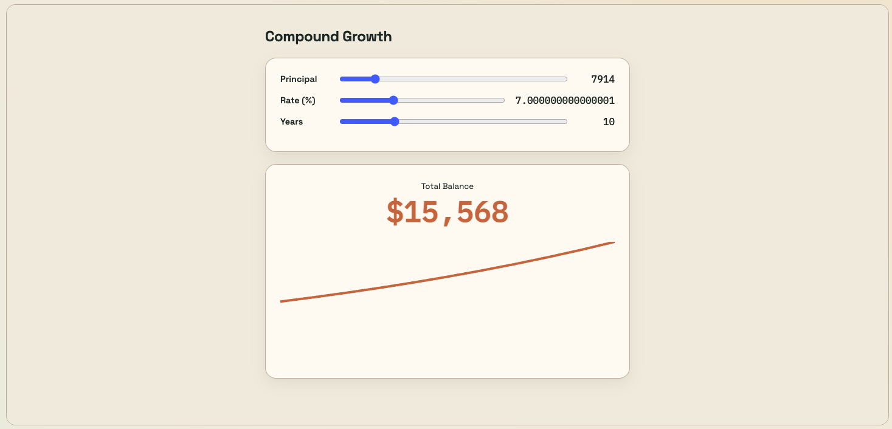
      </a>
    </td>
    <td align="center" valign="top" width="50%">
      <strong>Google Gemini 2.5 Flash</strong><br />
      <code>14,678 ms</code><br />
      <a href="images/compound-interest-calc/google-gemini-2.5-flash-14678ms.png">
        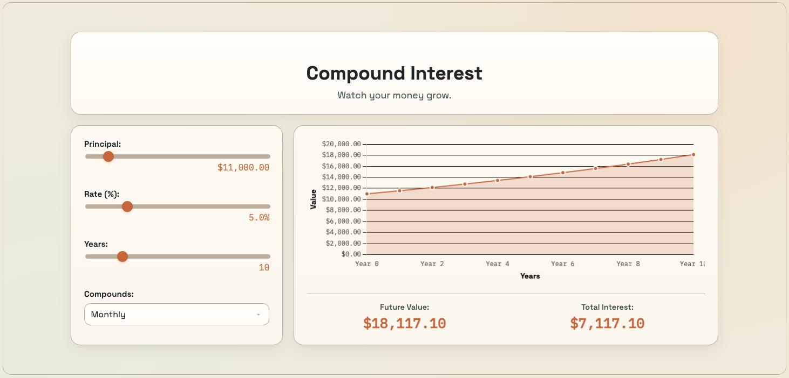
      </a>
    </td>
  </tr>
  <tr>
    <td align="center" valign="top" width="50%">
      <strong>Anthropic Claude Haiku 4.5</strong><br />
      <code>23,071 ms</code><br />
      <a href="images/compound-interest-calc/anthropic-claude-haiku-4.5-23071ms.png">
        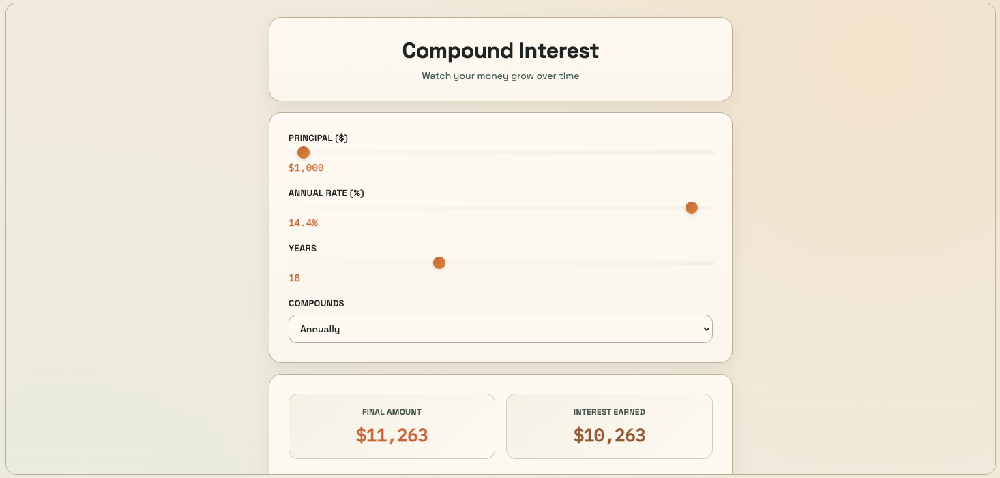
      </a>
    </td>
    <td align="center" valign="top" width="50%">
      <strong>Anthropic Claude Sonnet 4.6</strong><br />
      <code>60,213 ms</code><br />
      <a href="images/compound-interest-calc/anthropic-claude-sonnet-4.6-60213ms.png">
        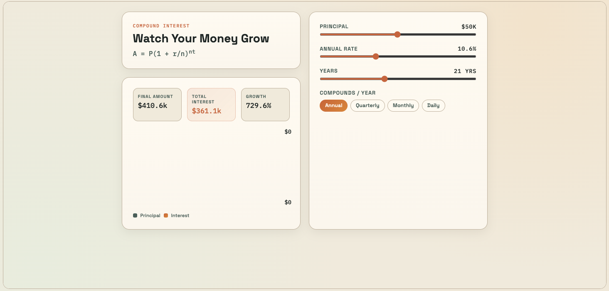
      </a>
    </td>
  </tr>
  <tr>
    <td align="center" valign="top" width="50%">
      <strong>Anthropic Claude Opus 4.6</strong><br />
      <code>79,230 ms</code><br />
      <a href="images/compound-interest-calc/anthropic-claude-opus-4.6-79230ms.png">
        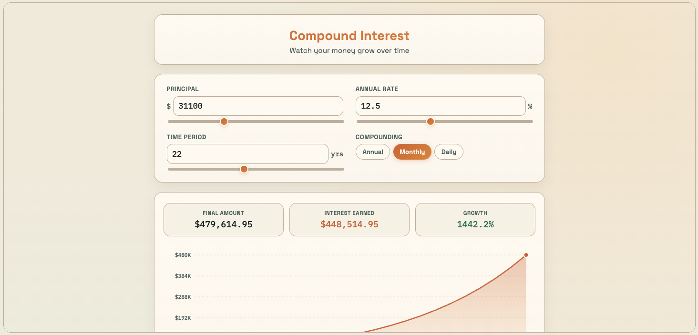
      </a>
    </td>
    <td align="center" valign="top" width="50%">
      <strong>OpenAI GPT-5 Mini</strong><br />
      <code>102,677 ms</code><br />
      <a href="images/compound-interest-calc/openai-gpt-5-mini-102677ms.png">
        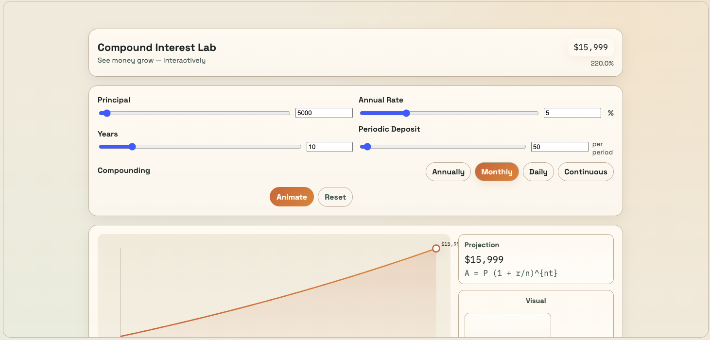
      </a>
    </td>
  </tr>
  <tr>
    <td align="center" valign="top" width="50%">
      <strong>Google Gemini 3.1 Pro Preview</strong><br />
      <code>119,583 ms</code><br />
      <a href="images/compound-interest-calc/google-gemini-3.1-pro-preview-119583ms.png">
        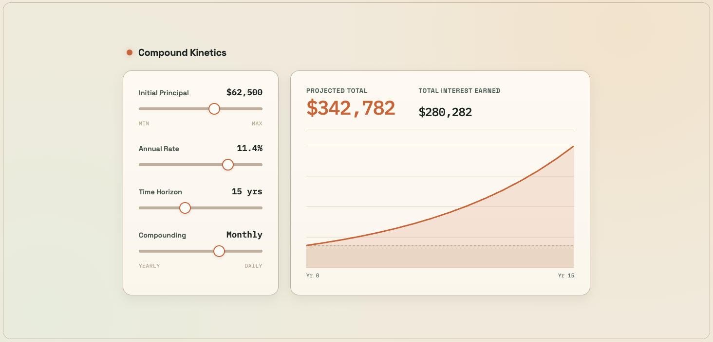
      </a>
    </td>
    <td align="center" valign="top" width="50%">
      <strong>OpenAI GPT-5.2</strong><br />
      <code>179,911 ms</code><br />
      <a href="images/compound-interest-calc/openai-gpt-5.2-179911ms.png">
        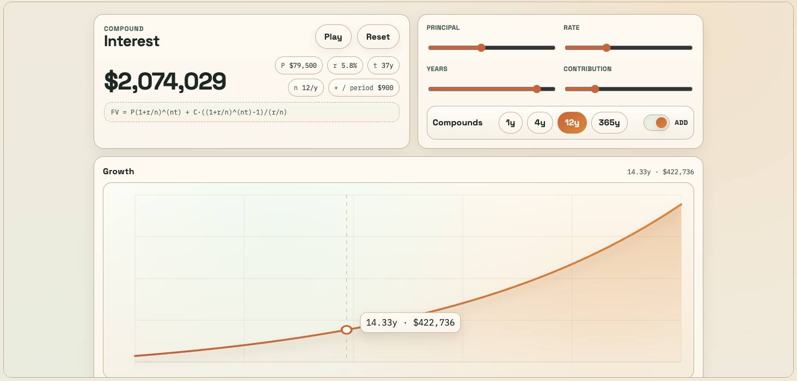
      </a>
    </td>
  </tr>
  <tr>
    <td align="center" valign="top" colspan="2">
      <strong>OpenAI GPT-5.4</strong><br />
      <code>287,075 ms</code><br />
      <a href="images/compound-interest-calc/openai-gpt-5.4-287075ms.png">
        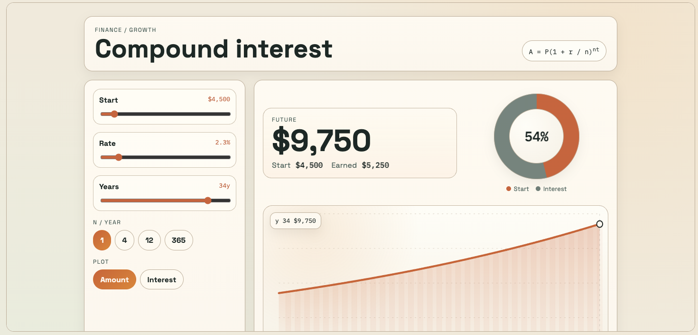
      </a>
    </td>
  </tr>
</table>

Model comparisons:
- Speed: #1 Gemini, #2 Claude, #3 GPT
- Quality: GPT 5.4 takes the cake. Gemini 3.1 Pro Preview is second. Claude Opus 4.6 is third.

Some of the great choices look like:
- Gemini 3.1 Flash Lite Preview: 4 seconds is simply astounding, and I'm sure with better prompting the quality can be amped up.
- Claude Opus 4.6: 79 seconds is long, but not crazy long. Quality-wise it's more than great.

GPT 5.4: IMO the highest quality output, but 287 seconds (4.5 minutes) is pretty long. Again, depends on the use case. If quality is a non-negotiable and latency is not a factor, this is a good choice.

### Experiment 2: "i want to learn what happens when light approaches a black hole":

<table>
  <tr>
    <td align="center" valign="top" width="50%">
      <strong>Google Gemini 3.1 Flash Lite Preview</strong><br />
      <code>4,617 ms</code><br />
      <a href="images/black-holes/google-gemini-3.1-flash-lite-preview-4617ms.png">
        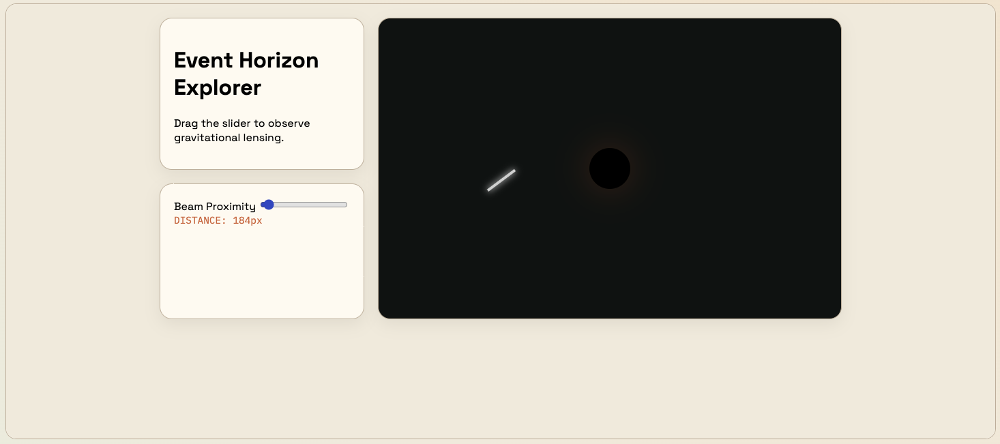
      </a>
    </td>
    <td align="center" valign="top" width="50%">
      <strong>Google Gemini 2.5 Flash</strong><br />
      <code>15,446 ms</code><br />
      <a href="images/black-holes/google-gemini-2.5-flash-15446.png">
        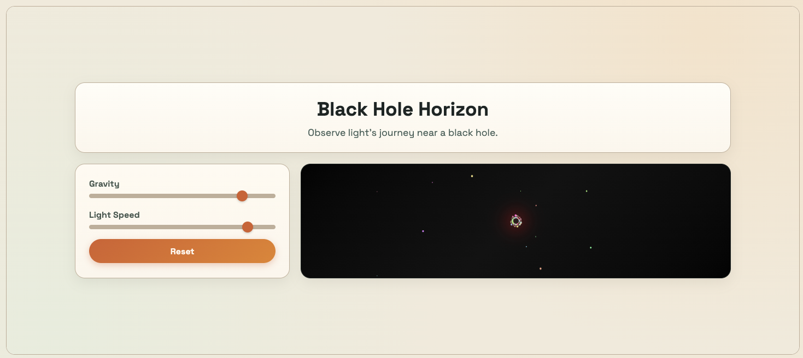
      </a>
    </td>
  </tr>
  <tr>
    <td align="center" valign="top" width="50%">
      <strong>Anthropic Claude Haiku 4.5</strong><br />
      <code>25,802 ms</code><br />
      <a href="images/black-holes/anthropic-claude-haiku-4.5-25802ms.png">
        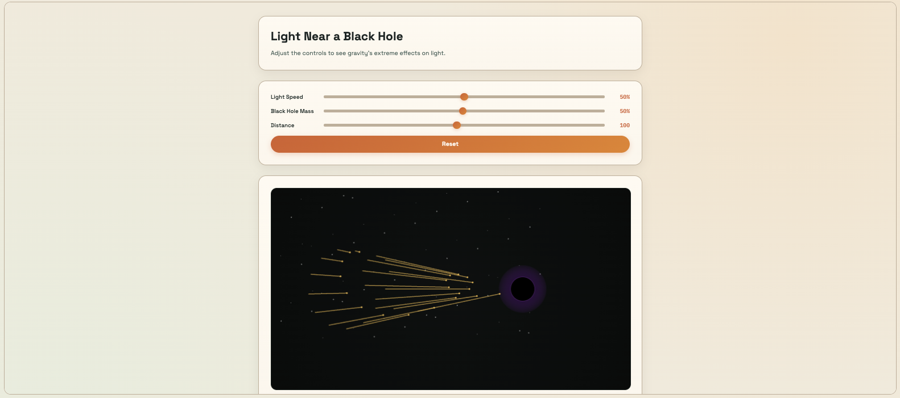
      </a>
    </td>
    <td align="center" valign="top" width="50%">
      <strong>Anthropic Claude Sonnet 4.6</strong><br />
      <code>69,975 ms</code><br />
      <a href="images/black-holes/anthropic-claude-sonnet-4.6-69975ms.png">
        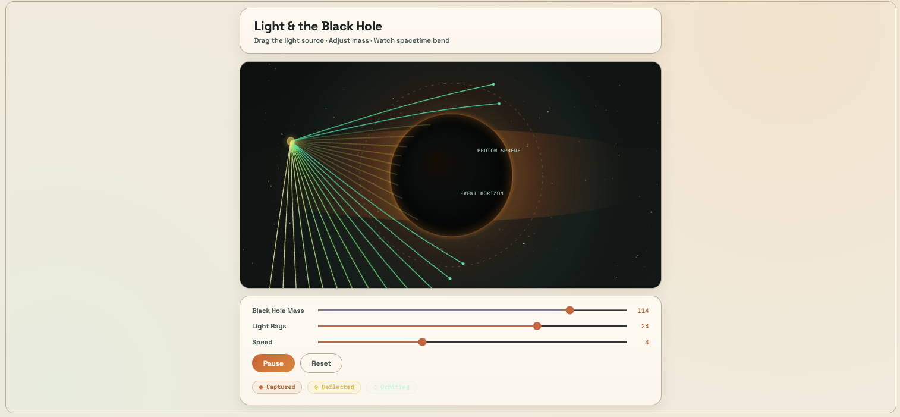
      </a>
    </td>
  </tr>
  <tr>
    <td align="center" valign="top" width="50%">
      <strong>Anthropic Claude Opus 4.6</strong><br />
      <code>86,263 ms</code><br />
      <a href="images/black-holes/anthropic-claude-opus-4.6-86263ms.png">
        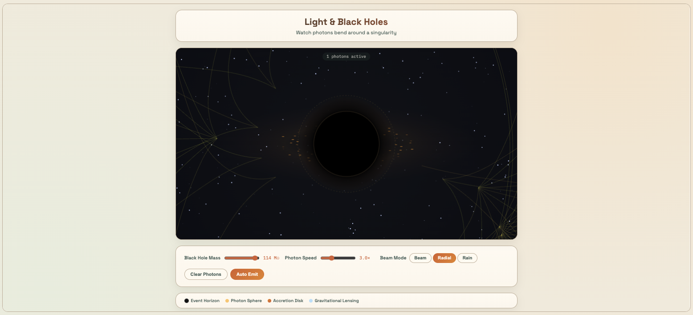
      </a>
    </td>
    <td align="center" valign="top" width="50%">
      <strong>OpenAI GPT-5 Mini</strong><br />
      <code>96,070 ms</code><br />
      <a href="images/black-holes/openai-gpt-5-mini-96070ms.png">
        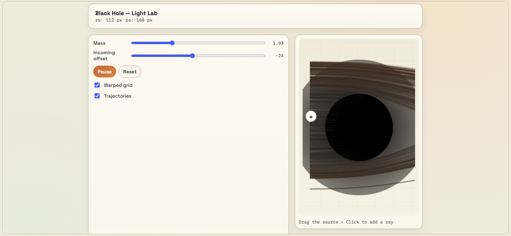
      </a>
    </td>
  </tr>
  <tr>
    <td align="center" valign="top" width="50%">
      <strong>Google Gemini 3.1 Pro Preview</strong><br />
      <code>154,100 ms</code><br />
      <a href="images/black-holes/google-gemini-3.1-pro-preview-154100ms.png">
        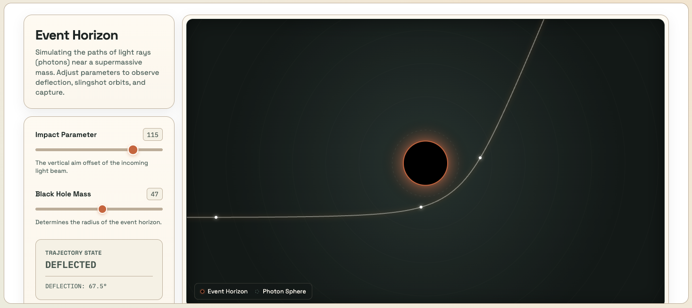
      </a>
    </td>
    <td align="center" valign="top" width="50%">
      <strong>OpenAI GPT-5.2</strong><br />
      <code>188,725 ms</code><br />
      <a href="images/black-holes/openai-gpt-5.2-188725ms.png">
        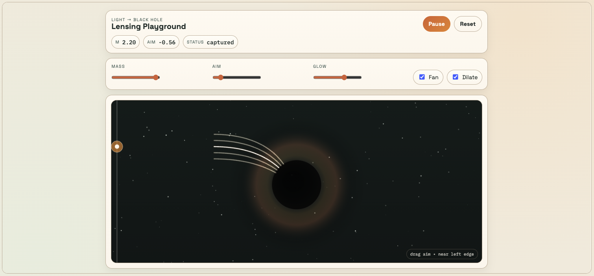
      </a>
    </td>
  </tr>
  <tr>
    <td align="center" valign="top" colspan="2">
      <strong>OpenAI GPT-5.4</strong><br />
      <code>356,056 ms</code><br />
      <a href="images/black-holes/openai-gpt-5.4-356056ms.png">
        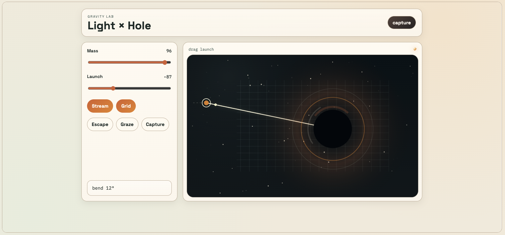
      </a>
    </td>
  </tr>
</table>

Model comparisons:
- Speed: Gemini was generally the fastest, followed by Anthropic and lastly OpenAI
- Quality: Gemini 3.1 Pro Preview is the only one that actually answered my question, with Claude Opus 4.6 as a close second.

This task is arguably a lot more complex than a simple calculator. Hence I believe quality is the greatest factor, with latency as a secondary factor.
- Gemini 3.1 Pro Preview: brilliant quality, answered the question exactly. 154 seconds (2.5 mins) is not terrible given the type of task.
- Claude Opus 4.6: great quality, answered the question well. 86 seconds (1.3 mins) is pretty good given the type of task.

The rest of the models (including all of the OpenAI ones) were either way too slow in this case, or the quality was just not up to par.

## Experiment takeaways

I want to emphasise that LLM generations are non-deterministic, so for the same model and task, you can get very different outputs from run-to-run. But, I have gone through the effort to do multiple runs of some of these models, and I can say that their general quality/latency tradeoffs is quite consistent.

Now let's get practical for a second.

Probably the one and only successful use cases for Generative UI as of now are vibe-coding apps like Lovable. But this is really not just Generative UI, but fully generated and deployable apps.

Other than that, 99.99% of apps would probably not benefit from Generative UI as an embeddable product feature.

A real world use case I can think of:
- A customer service chatbot which dynamically generates buttons based on a user's input/question. (even this example is up for debate, because the backend actions would already be hardcoded, so the LLM would really just be choosing which backend actions to present, and not necessarily generating novel UI)

Or even an app idea:
- An early-learning education app, where parents can create fun little educational games for their children, from a single prompt. Something like "I want to teach my kid the lifecycle of a frog" or "create a fun basic addition and subtraction game". Generative UI could serve as part of the core functionality.

Having said all of this, based on the results of my experiments, if I had to implement Generative UI in a real-world project, I would first identify the complexity of the apps that would be generated (i.e. the variation of expected prompts):

> Are the apps limited to basic functionalities, like calculators or simple games?

Using a cheap and fast model like Gemini 3.1 Flash Lite Preview makes a lot of sense.

> Can the prompts vary significantly? Are we planning to support everything from RNA polymerase animation to black hole simulators?

A router-based approach makes sense. The first LLM call should be a light-weight decision of which model to use based on the complexity of the prompt. And then, use these models, in order of increasing complexity: Gemini 3.1 Flash Lite Preview, Claude Opus 4.6, Gemini 3.1 Pro Preview.

## Final words

You *shouldn't* be using Generative UI in real-world project unless you ***reeeeeeeeally*** have no other option. Trust me, a deterministic flow is probably all you need, and it's going to be a billion times cheaper and faster.

But it's a darn cool idea. Maybe a nifty little portfolio website totem!

[Generative UI: A rich, custom, visual interactive user experience for any prompt](https://research.google/blog/generative-ui-a-rich-custom-visual-interactive-user-experience-for-any-prompt/)
